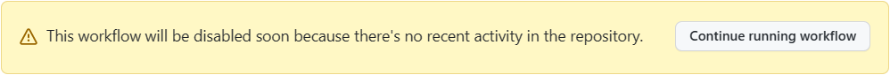
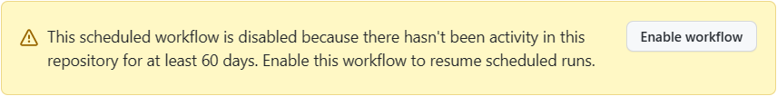

# Keep scheduled workflow activity

With this GitHub Action, scheduled workflow won't be disabled even if there's no recent activity in the repository.

English | [简体中文](README.zh-CN.md)

## Why

In GitHub, scheduled workflows are automatically disabled when no repository activity has occurred in 60 days.

When approaching 60 days, it will show:

> This workflow will be disabled soon because there's no recent activity in the repository.



After 60 days, it will show:

> This scheduled workflow is disabled because there hasn't been activity in this repository for at least 60 days.



## Usage

### GitHub Action

```yml
name: Keep scheduled workflow activity

on:
  schedule:
    - cron: '0 0 * * *' # 00:00 UTC every day

jobs:
  keep-scheduled-workflow-activity:
    runs-on: ubuntu-latest
    steps:
      - name: Keep scheduled workflow activity
        uses: WaterLemons2k/scheduled-workflow-activity-action@v1
```

### Reusable workflow

```yml
name: Keep scheduled workflow activity

on:
  schedule:
    - cron: '0 0 * * *' # 00:00 UTC every day

jobs:
  keep-scheduled-workflow-activity:
    uses: WaterLemons2k/scheduled-workflow-activity-action/.github/workflows/reusable.yml@v1
```

## Inputs

All inputs are optional.

| Input       | Description                      | Default               |
| ----------- | -------------------------------- | --------------------- |
| `token`     | Access token for the GitHub API. | `${{ github.token }}` |
| `workflows` | Workflows to keep activity.      | The workflow          |
