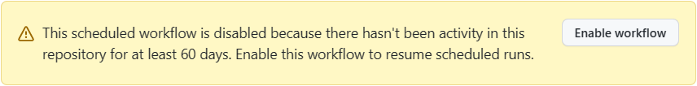

# 保持定时工作流活动

使用这个 GitHub Action，即使最近没有仓库活动也不会禁用定时工作流。

[English](README.md) | 简体中文

## 为什么

在 GitHub 中, 当 60 天没有仓库活动发生时将自动禁用定时工作流。

接近 60 天时会显示：

> This workflow will be disabled soon because there's no recent activity in the repository.（此工作流将很快被禁用，因为仓库最近没有活动。）


60 天后会显示：

> This scheduled workflow is disabled because there hasn't been activity in this repository for at least 60 days.（此定时工作流已被禁用，因为此仓库至少 60 天没有活动。）



## 使用

### GitHub Action

```yml
name: Keep scheduled workflow activity

on:
  schedule:
    - cron: '0 0 * * *' # 每天 00:00 UTC

jobs:
  keep-scheduled-workflow-activity:
    runs-on: ubuntu-latest
    steps:
      - name: Keep scheduled workflow activity
        uses: WaterLemons2k/scheduled-workflow-activity-action@v1
```

### 可重用（reusable）工作流

```yml
name: Keep scheduled workflow activity

on:
  schedule:
    - cron: '0 0 * * *' # 每天 00:00 UTC

jobs:
  keep-scheduled-workflow-activity:
    uses: WaterLemons2k/scheduled-workflow-activity-action/.github/workflows/reusable.yml@v1
```

## 输入

所有输入都是可选的。

| 输入        | 描述                    | 默认                  |
| ----------- | ----------------------- | --------------------- |
| `token`     | GitHub API 的访问令牌。 | `${{ github.token }}` |
| `workflows` | 要保持活动的工作流。    | 此工作流              |
